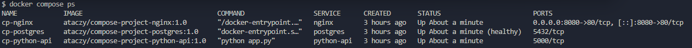
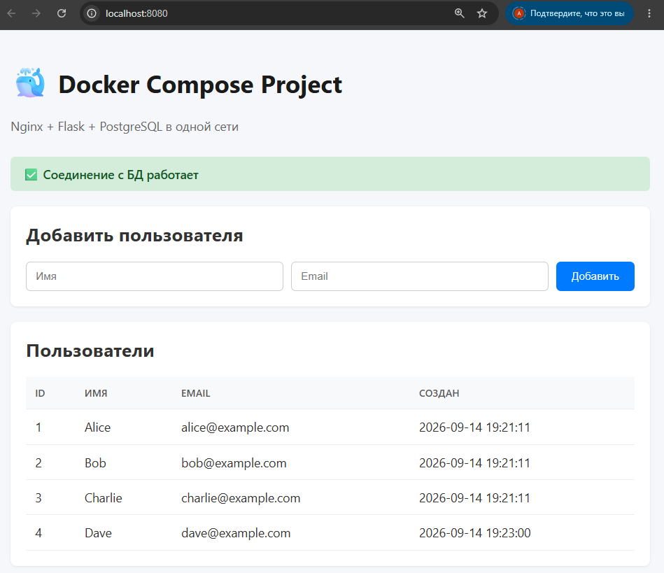
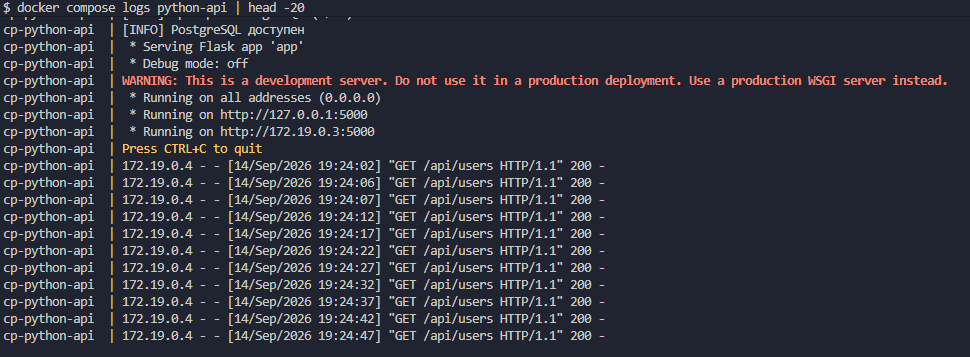
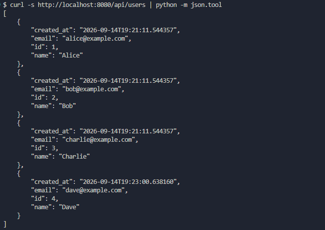

# Docker Compose Project

Учебный проект по Docker Compose: три контейнера (Nginx + Flask + PostgreSQL), объединённые в одну сеть, с volume для хранения данных БД.

## Что внутри

- **Nginx** — раздаёт HTML-страницу и проксирует API-запросы на Flask
- **Flask** — REST API для работы с таблицей `users`
- **PostgreSQL** — база данных с named volume

## Запуск

```bash
# 1. Скопировать переменные окружения
cp .env.example .env

# 2. Собрать и запустить
docker compose up -d --build

# 3. Открыть в браузере
# http://localhost:8080
```

## Остановка

```bash
docker compose down       # остановить, данные сохранятся
docker compose down -v    # остановить и удалить volume (данные пропадут)
```

## API

| Метод | Путь | Описание |
|-------|------|----------|
| GET | `/api/users` | Список пользователей |
| POST | `/api/users` | Добавить пользователя: `{"name": "...", "email": "..."}` |
| GET | `/health` | Проверка соединения с БД |

Пример:

```bash
curl http://localhost:8080/api/users

curl -X POST http://localhost:8080/api/users \
  -H "Content-Type: application/json" \
  -d '{"name":"Dave","email":"dave@example.com"}'
```

## Структура

```
.
├── compose.yaml
├── .env.example
├── .gitignore
├── .dockerignore
├── README.md
├── postgres/
│   ├── Dockerfile
│   └── init.sql
├── python-api/
│   ├── Dockerfile
│   ├── requirements.txt
│   └── app.py
└── nginx/
    ├── Dockerfile
    ├── nginx.conf
    └── html/
        └── index.html
```

## Образы на Docker Hub

- [ataczy/compose-project-postgres](https://hub.docker.com/r/ataczy/compose-project-postgres)
- [ataczy/compose-project-python-api](https://hub.docker.com/r/ataczy/compose-project-python-api)
- [ataczy/compose-project-nginx](https://hub.docker.com/r/ataczy/compose-project-nginx)

## Скриншоты

### Статус контейнеров



### Веб-интерфейс



### Логи Python API



### Проверка API через curl



## Полезные команды

```bash
# Посмотреть статус всех сервисов
docker compose ps

# Логи всех сервисов
docker compose logs

# Логи одного сервиса в реальном времени
docker compose logs -f python-api

# Зайти в контейнер PostgreSQL
docker compose exec postgres psql -U myuser -d mydb

# Перезапустить один сервис
docker compose restart nginx

# Пересобрать образы без кэша
docker compose build --no-cache

# Пересобрать и запустить
docker compose up -d --build

# Проверить конфиг compose.yaml с подставленными переменными
docker compose config

# Посмотреть, какие volumes созданы
docker volume ls

# Посмотреть, где лежит volume pgdata
docker volume inspect compose-project_pgdata
```

## Что было потренировано

- Описание нескольких сервисов в одном `compose.yaml`
- Своя bridge-сеть `app-net`, контейнеры видят друг друга по имени сервиса
- Named volume `pgdata` для данных PostgreSQL
- `healthcheck` + `depends_on` — Flask не стартует раньше готовности БД
- Reverse proxy в Nginx
- Переменные окружения через `.env`